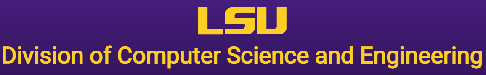

<div id="top"></div>
<!--
*** Thanks for checking out the Best-README-Template. If you have a suggestion
*** that would make this better, please fork the repo and create a pull request
*** or simply open an issue with the tag "enhancement".
*** Don't forget to give the project a star!
*** Thanks again! Now go create something AMAZING! :D
-->


<!-- PROJECT SHIELDS -->
<!--
*** I'm using markdown "reference style" links for readability.
*** Reference links are enclosed in brackets [ ] instead of parentheses ( ).
*** See the bottom of this document for the declaration of the reference variables
*** for contributors-url, forks-url, etc. This is an optional, concise syntax you may use.
*** https://www.markdownguide.org/basic-syntax/#reference-style-links
-->
<div align="center">

[![Contributors][contributors-shield]][contributors-url]
[![Forks][forks-shield]][forks-url]
[![Issues][issues-shield]][issues-url]
[![MIT License][license-shield]][license-url]

</div>

<!-- PROJECT LOGO -->
<br />

<div align="center">
  <a href="https://www.lsu.edu/eng/cse/index.php">
    
  </a>

<h3 align="center">Predicting Song Popularity with Neural Networks</h3>

  <p align="center">
    <br />
    <a href="https://github.com/cadegw1/song-popularity-predictor/issues">Report Bug</a>
    ·
    <a href="https://github.com/cadegw1/song-popularity-predictor/issues">Request Feature</a>
  </p>
</div>


<!-- TABLE OF CONTENTS -->
<details>
  <summary>Table of Contents</summary>
  <!-- TOC -->

- [About The Project](#about-the-project)
  - [Built With](#built-with)
- [Getting Started](#getting-started)
  - [Prerequisites](#prerequisites)
  - [Installation](#installation)
  - [Anaconda Setup](#anaconda-setup)
- [Usage](#usage)
- [License](#license)
- [Contact](#contact)
- [Acknowledgments](#acknowledgments)

<!-- /TOC -->
</details>


<!-- ABOUT THE PROJECT -->
## About The Project


The purpose of this project is to design and implement a song popularity predictor. The goal is to determine if the chance of a song becoming a hit can be calculated using regression neural networks. Examples of song features that could be considered include song genre, tempo, and loudness. For training the network, both a custom-made dataset and a dataset called Spotify_Features pulled from an online source will be considered. There are countless aspects that play into the success rate of a song, such as language or artist location; however, due to limitations, we are investigating if we can remove low-impact features without noticeably affecting prediction accuracy. A song popularity predictor would give artists, record labels, and producers an estimated success rate of their song solely based on original characteristics of the audio itself.

<p align="right">(<a href="#top">back to top</a>)</p>


### Built With

* [Python 3.8](https://www.python.org/downloads/release/python-380/)
* [Pandas](https://pandas.pydata.org/)
* [Numpy](https://numpy.org/)
* [PyCaret](https://pycaret.org/)
* [Spotipy](https://spotipy.readthedocs.io/en/2.19.0/)
* [Matplotlib](https://matplotlib.org/)
* [Anaconda](https://anaconda.org/)

<p align="right">(<a href="#top">back to top</a>)</p>


<!-- GETTING STARTED -->
## Getting Started

First, fork the repository [here](https://github.com/cadegw1/song-popularity-predictor). If you plan to run the program with anaconda then please skip to the [Anaconda Setup](#anaconda-setup).

### Prerequisites
A spotify developer account is required and can be created [here](https://developer.spotify.com/).
1. In the dashboard, create a new app.

2. Copy the 'Client Id' and 'Client Secret'.

3. Create two environment variables called 'SPOTIPY_CLIENT_ID' and 'SPOTIPY_CLIENT_SECRET' containing the copied values of 'Client Id' and 'Client Secret'.


### Installation

1. All packages can be installed using pip. Links to packages used can be found [here](#built-with)


<p align="right">(<a href="#top">back to top</a>)</p>


### Anaconda Setup
An environment.yml file has been provided for anaconda implementation.
1. Follow steps 1 and 2 in the [Prerequisites](#prerequisites) to obtain a 'Client Id' and 'Client Secret'.

2. In the environment.yml file, paste the copied values in the variables section
```yml
variables:
    SPOTIPY_CLIENT_ID:
    SPOTIPY_CLIENT_SECRET:
```

3. Create a new anaconda env using the environment.yml
```sh
conda env create -f environment.yml
```

4. Activate the anaconda env
```sh
conda activate csc4444_SemProj
```

For more in-depth instructions using anaconda please refer to the [documentation](https://docs.conda.io/projects/conda/en/latest/user-guide/tasks/manage-environments.html).

<!-- USAGE EXAMPLES -->
## Usage

This is a conceptual implementation of how to predict a songs popularity using Spotify features. Examples of real world use would be a producer or artist estimating their songs predicted popularity.


<p align="right">(<a href="#top">back to top</a>)</p>


<!-- LICENSE -->
## License

Distributed under the MIT License. See `LICENSE.txt` for more information.

<p align="right">(<a href="#top">back to top</a>)</p>


<!-- CONTACT -->
## Contact

### Contributors

**Armando Castillo III** <br />
Github profile - https://github.com/ArmandoCIII <br />
Secondary profile - https://github.com/armycastillo

**Cade Williams** <br />
Github profile - https://github.com/cadegw1

**Hayden Gemeinhardt** <br />
Github profile - https://github.com/haydengemeinhardt

**Lauren Chauvin** <br />
Github profile - https://github.com/lchauvin03

**Carson Hymel** <br />
Github profile - https://github.com/Chymel

<p align="right">(<a href="#top">back to top</a>)</p>


<!-- ACKNOWLEDGMENTS -->
## Acknowledgments

* [How to Extract Data Using Spotify's API, Python and Spotipy](https://morioh.com/p/31b8a607b2b0)
* [Spotify Tracks DB](https://www.kaggle.com/zaheenhamidani/ultimate-spotify-tracks-db)
* [Ignore Low Variance](https://pycaret.org/ignore-low-variance/)

<p align="right">(<a href="#top">back to top</a>)</p>


<!-- MARKDOWN LINKS & IMAGES -->
<!-- https://www.markdownguide.org/basic-syntax/#reference-style-links -->
[contributors-shield]: https://img.shields.io/github/contributors/cadegw1/song-popularity-predictor.svg?style=for-the-badge
[contributors-url]: https://github.com/cadegw1/song-popularity-predictor/graphs/contributors
[forks-shield]: https://img.shields.io/github/forks/cadegw1/song-popularity-predictor.svg?style=for-the-badge
[forks-url]: https://github.com/cadegw1/song-popularity-predictor/network/members
[issues-shield]: https://img.shields.io/github/issues/cadegw1/song-popularity-predictor.svg?style=for-the-badge
[issues-url]: https://github.com/cadegw1/song-popularity-predictor/issues
[license-shield]: https://img.shields.io/github/license/cadegw1/song-popularity-predictor.svg?style=for-the-badge
[license-url]: https://github.com/cadegw1/song-popularity-predictor/blob/main/LICENSE.txt

<!--
MIT License

Copyright (c) 2021 Othneil Drew

Permission is hereby granted, free of charge, to any person obtaining a copy
of this software and associated documentation files (the "Software"), to deal
in the Software without restriction, including without limitation the rights
to use, copy, modify, merge, publish, distribute, sublicense, and/or sell
copies of the Software, and to permit persons to whom the Software is
furnished to do so, subject to the following conditions:

The above copyright notice and this permission notice shall be included in all
copies or substantial portions of the Software.

THE SOFTWARE IS PROVIDED "AS IS", WITHOUT WARRANTY OF ANY KIND, EXPRESS OR
IMPLIED, INCLUDING BUT NOT LIMITED TO THE WARRANTIES OF MERCHANTABILITY,
FITNESS FOR A PARTICULAR PURPOSE AND NONINFRINGEMENT. IN NO EVENT SHALL THE
AUTHORS OR COPYRIGHT HOLDERS BE LIABLE FOR ANY CLAIM, DAMAGES OR OTHER
LIABILITY, WHETHER IN AN ACTION OF CONTRACT, TORT OR OTHERWISE, ARISING FROM,
OUT OF OR IN CONNECTION WITH THE SOFTWARE OR THE USE OR OTHER DEALINGS IN THE
SOFTWARE.
-->
